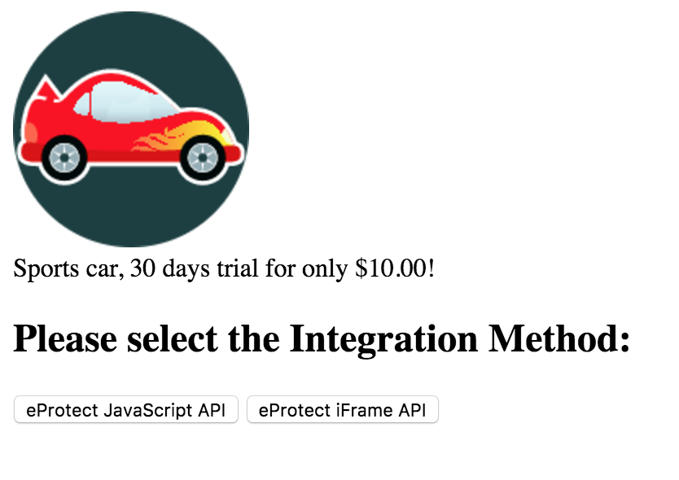
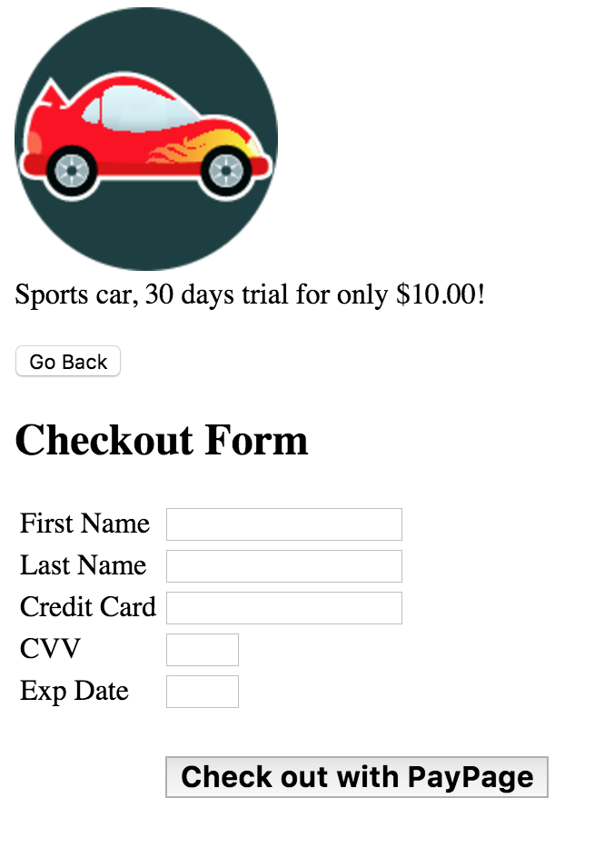
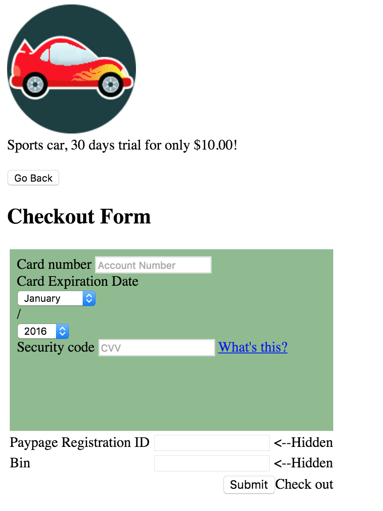
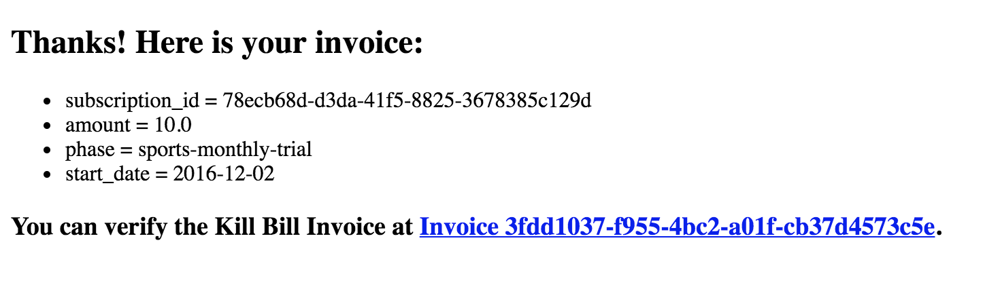

Kill Bill Litle Demo
====================

This sample app shows you how to integrate Litle (Vantiv) eProtect (PayPage) features with [Kill Bill subscriptions APIs](http://docs.killbill.io/0.16/userguide_subscription.html).

Prerequisites
-------------

Ruby 2.1+ or JRuby 1.7.20+ is recommended. If you don’t have a Ruby installation yet, use [RVM](https://rvm.io/rvm/install):

```
gpg --keyserver hkp://keys.gnupg.net --recv-keys 409B6B1796C275462A1703113804BB82D39DC0E3
\curl -sSL https://get.rvm.io | bash -s stable --ruby
```

After following the post-installation instructions, you should have access to the ruby and gem executables.

Install the dependencies by running in this folder:

```
gem install bundler
bundle install
```

This also assumes:

* Kill Bill is [already setup](http://docs.killbill.io/0.20/getting_started.html)
* The default tenant (bob/lazar) has been created
* The [Litle plugin](https://github.com/killbill/killbill-litle-plugin) is installed and configured with valid credentials.

Run
---

To run the app:

```
KB_URL='http://<host>:<port>' PAYPAGE_ID='<PAYPAGE_ID>' MERCHANT_TX_ID='<MERCHANT_ID>' ORDER_ID='<ORDER_ID>' REPORT_GROUP='<REPORT_GROUP>' ruby app.rb

```

Then go to [http://localhost:4567/](http://localhost:4567/) where you should see the **Checkout Form** loaded from Litle (Vantiv).

You will need to select the desired Integration Method between:
* eProtect JavaScript API
* eProtect iFrame API



If you selected **eProtect JavaScript API**, you will need to complete the following fields:

* First Name
* Last Name
* Credit Card number (Account Number for Litle)
* Credit Card Security Code
* Credit Card Expiration Date (Month and Year)

Then click the **Checkout with PayPage** button to proceed with Checkout.

That will:

* Tokenize the Credit Card in Litle (Vantiv)
* Create a new Kill Bill account
* Add a default payment method on this account associated with this token
* Create a new subscription for the sports car monthly plan (with a $10 30-days trial)
* Charge the token for $10



If you selected **eProtect iFrame API**, you will need to complete the following fields:
* Credit Card number (Account Number for Litle)
* Credit Card Expiration Date (Month and Year)
* Credit Card Security Code

Then click the **Submit** button to proceed with Checkout.

That will:

* Tokenize the Credit Card in Litle (Vantiv)
* Create a new Kill Bill account
* Add a default payment method on this account associated with this token
* Create a new subscription for the sports car monthly plan (with a $10 30-days trial)
* Charge the token for $10



Both of them will then open the Thank You page:

